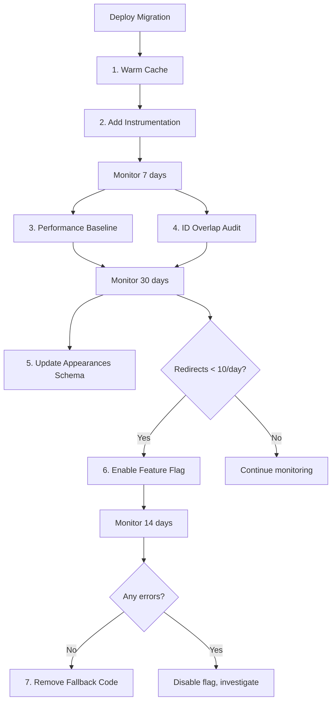

# Actor URL Migration - Potential Enhancements

**Branch**: `feat/actor-url-enhancements`
**Based on**: `feat/actor-url-migration`
**Status**: Proposal for consideration

## Overview

This document outlines potential enhancements to consider after the initial actor URL migration. Each item includes implementation effort, value, and priority assessment.

---

## 1. Cache Warming Script 🔥

**Priority**: HIGH
**Effort**: LOW (2-3 hours)
**Value**: Eliminates 24-48 hour cold cache period

### Problem
After deployment, Redis cache will be cleared. Popular actors will experience slow initial page loads until cache warms naturally.

### Proposal
Create `scripts/warm-actor-cache.ts` to pre-warm cache for top actors:

```typescript
// Warm cache for top N actors by popularity
async function warmActorCache(limit: number = 1000) {
  const actors = await getTopActorsByPopularity(limit)

  for (const actor of actors) {
    // Trigger cache warming by fetching actor data
    await getActorById(actor.id)
    await getActorDeathDetails(actor.id)
  }
}
```

**Run after deployment**:
```bash
cd server && npm run cache:warm -- --limit 1000
```

**Benefits**:
- Instant cache hits for 95%+ of traffic
- Better user experience immediately post-deployment
- Controlled cache warming vs unpredictable organic warming

---

## 2. Redirect Instrumentation with New Relic 📊

**Priority**: MEDIUM
**Effort**: LOW (1-2 hours)
**Value**: Better visibility into migration impact

### Problem
Current implementation redirects but doesn't track:
- How often redirects occur
- Which actors get redirected most
- User impact (are they clicking old bookmarks, Google results, etc?)

### Proposal
Add New Relic custom events in `getActorByEitherIdWithSlug()`:

```typescript
if (matchedByTmdbId) {
  // Record redirect event
  newrelic.recordCustomEvent('ActorUrlRedirect', {
    actorId: actor.id,
    tmdbId: actor.tmdb_id,
    actorName: actor.name,
    slug: slug,
    matchType: 'tmdb_id',
    userAgent: req.headers['user-agent'],
    referer: req.headers['referer']
  })
}
```

**Dashboard queries**:
```sql
-- Top actors being accessed via old URLs
SELECT actor_name, COUNT(*) as redirect_count
FROM ActorUrlRedirect
SINCE 7 days ago
GROUP BY actor_name
ORDER BY redirect_count DESC
LIMIT 20

-- Redirect trend over time
SELECT count(*)
FROM ActorUrlRedirect
TIMESERIES AUTO
SINCE 30 days ago
```

**Benefits**:
- Understand migration impact on users
- Identify if search engines need sitemap resubmission
- Data-driven decision on when to remove fallback

---

## 3. Feature Flag for Redirect Removal 🚩

**Priority**: LOW
**Effort**: MEDIUM (3-4 hours)
**Value**: Clean code, slight performance gain after transition period

### Problem
Migration docs suggest optionally removing `tmdb_id` fallback after 90 days, but no mechanism exists to:
- Test removal safely
- Roll back if needed
- Gradually reduce redirect support

### Proposal
Add environment variable to control redirect behavior:

```typescript
// .env
ACTOR_URL_TMDB_FALLBACK_ENABLED=true  # or false to disable

// In getActorByEitherIdWithSlug()
if (process.env.ACTOR_URL_TMDB_FALLBACK_ENABLED === 'false') {
  // Only match by actor.id, no tmdb_id fallback
  return await getActorByIdWithSlug(id, expectedSlug)
}
```

**Migration path**:
1. Deploy with flag enabled (default)
2. Monitor redirects for 90 days
3. If redirects < 10/day, set flag to false
4. Monitor errors for 14 days
5. If no issues, remove code in next release

**Benefits**:
- Safe, gradual transition
- Instant rollback if needed
- Removes ~5 lines of code per query eventually

---

## 4. Query Performance Baseline 📈

**Priority**: MEDIUM
**Effort**: LOW (1 hour)
**Value**: Quantify OR query overhead

### Problem
Migration docs estimate <0.5ms overhead for OR query, but no actual measurements exist.

### Proposal
Add query timing in development mode:

```typescript
const startTime = performance.now()
const actor = await getActorByEitherIdWithSlug(id, slug)
const duration = performance.now() - startTime

if (process.env.NODE_ENV === 'development') {
  console.log(`[PERF] getActorByEitherIdWithSlug: ${duration.toFixed(2)}ms`)
}

// Also record in New Relic
newrelic.recordMetric('Custom/ActorQuery/Duration', duration)
```

**New Relic dashboard**:
```sql
SELECT average(newrelic.timeslice.value)
FROM Metric
WHERE metricTimesliceName = 'Custom/ActorQuery/Duration'
TIMESERIES AUTO
SINCE 7 days ago
```

**Benefits**:
- Confirm <0.5ms assumption
- Identify if indexes are needed
- Track performance regression over time

---

## 5. Similar Entity ID Overlap Audit 🔍

**Priority**: MEDIUM
**Effort**: MEDIUM (4-6 hours)
**Value**: Prevent future ID conflicts

### Problem
We discovered 99,003 actors with ID overlap. Do movies, shows, or episodes have similar issues?

### Proposal
Create `scripts/audit-id-overlaps.ts`:

```typescript
// Check all entity types for potential conflicts
async function auditIdOverlaps() {
  // Movies vs Shows
  const movieShowOverlap = await query(`
    SELECT COUNT(*) FROM movies m
    INNER JOIN shows s ON m.tmdb_id = s.tmdb_id
  `)

  // Movies vs Actors
  const movieActorOverlap = await query(`
    SELECT COUNT(*) FROM movies m
    INNER JOIN actors a ON m.tmdb_id = a.tmdb_id
  `)

  // Shows vs Actors
  const showActorOverlap = await query(`
    SELECT COUNT(*) FROM shows s
    INNER JOIN actors a ON s.tmdb_id = a.tmdb_id
  `)

  return {
    movieShowOverlap,
    movieActorOverlap,  // Already known: 99,003
    showActorOverlap
  }
}
```

**If overlaps found**:
- Document the issue
- Decide if movies/shows need internal IDs too
- Plan migration if necessary

**Benefits**:
- Comprehensive understanding of ID architecture
- Prevent future bugs
- Inform TMDB API usage patterns

---

## 6. Sitemap Search Engine Submission 🗺️

**Priority**: LOW
**Effort**: LOW (30 minutes)
**Value**: Faster Google indexing of new URLs

### Problem
Sitemap will regenerate with new URLs, but search engines won't know to re-crawl immediately.

### Proposal
Add script to notify search engines:

```bash
#!/bin/bash
# scripts/submit-sitemap.sh

SITEMAP_URL="https://deadonfilm.com/sitemap.xml"

# Google Search Console
curl "https://www.google.com/ping?sitemap=${SITEMAP_URL}"

# Bing Webmaster Tools
curl "https://www.bing.com/ping?sitemap=${SITEMAP_URL}"

echo "Sitemap submitted to search engines"
```

**Run after deployment**:
```bash
npm run sitemap:generate
npm run sitemap:submit
```

**Benefits**:
- Faster SEO recovery
- Reduced 404s from stale search results
- Better user experience from organic search

---

## 7. Stale URL Monitoring Alert 🚨

**Priority**: LOW
**Effort**: MEDIUM (2-3 hours)
**Value**: Early warning of problems

### Problem
If something goes wrong with redirects, we might not notice until users complain.

### Proposal
Add New Relic alert condition:

```sql
-- Alert if 404s spike on actor URLs
SELECT count(*)
FROM Transaction
WHERE request.uri LIKE '/api/actor/%'
  AND httpResponseCode = '404'
SINCE 5 minutes ago
```

**Alert threshold**: > 10 per minute

**Also monitor**:
```sql
-- Redirect rate shouldn't suddenly increase
SELECT count(*)
FROM ActorUrlRedirect
SINCE 1 hour ago
COMPARE WITH 1 day ago
```

**Benefits**:
- Proactive issue detection
- Faster incident response
- Confidence in migration

---

## 8. External Link Audit (Content) 🔗

**Priority**: LOW
**Effort**: HIGH (6-8 hours)
**Value**: Depends on how much hardcoded content exists

### Problem
If death circumstances or other text fields contain hardcoded links like:
```
See also: https://deadonfilm.com/actor/john-wayne-122844
```

These won't redirect (they're in text, not hrefs).

### Proposal
Audit and update hardcoded URLs in database:

```typescript
async function auditHardcodedUrls() {
  // Check death circumstances
  const circumstances = await query(`
    SELECT actor_id, official_circumstances
    FROM actor_death_circumstances
    WHERE official_circumstances LIKE '%deadonfilm.com/actor/%'
  `)

  // Check other text fields...

  // Generate report of links to update
}
```

**If found**: Create migration script to update URLs

**Benefits**:
- Consistent user experience
- No broken internal links
- Better analytics tracking

---

## 9. Batch Update Script for Appearance Tables ⚡

**Priority**: MEDIUM
**Effort**: MEDIUM (3-4 hours)
**Value**: Data integrity and future-proofing

### Problem
The `actor_movie_appearances` and `actor_show_appearances` tables still use `actor_tmdb_id` column names and foreign key references.

### Proposal
Add migration to:
1. Add `actor_id` column to appearances tables
2. Populate with `SELECT id FROM actors WHERE tmdb_id = actor_tmdb_id`
3. Update all foreign keys
4. Eventually deprecate `actor_tmdb_id` column

```sql
-- Phase 1: Add new column
ALTER TABLE actor_movie_appearances ADD COLUMN actor_id INTEGER;

-- Phase 2: Populate
UPDATE actor_movie_appearances ama
SET actor_id = a.id
FROM actors a
WHERE ama.actor_tmdb_id = a.tmdb_id;

-- Phase 3: Add foreign key
ALTER TABLE actor_movie_appearances
ADD CONSTRAINT fk_actor_movie_appearances_actor
FOREIGN KEY (actor_id) REFERENCES actors(id);
```

**Benefits**:
- Consistent naming (use internal IDs everywhere)
- Proper referential integrity
- Simpler queries (no JOIN needed to get actor.id)

---

## Summary Recommendation

### Implement Now (High Priority):
1. ✅ **Cache Warming Script** - Immediate value, low effort
2. ✅ **Redirect Instrumentation** - Critical for migration monitoring

### Implement in 30 Days (Medium Priority):
3. 🟡 **Query Performance Baseline** - Validate assumptions
4. 🟡 **ID Overlap Audit** - Understand full scope
5. 🟡 **Batch Update Appearances** - Data consistency

### Implement After 90 Days (Low Priority):
6. ⚪ **Feature Flag for Redirect Removal** - When redirects stabilize
7. ⚪ **Sitemap Submission** - If SEO is priority
8. ⚪ **Stale URL Alerts** - If monitoring gaps exist
9. ⚪ **External Link Audit** - If content has hardcoded URLs

---

## Implementation Order



---

**Next Steps**:
1. Review this proposal
2. Decide which items to implement
3. Create separate PR for high-priority items
4. Schedule medium/low priority for future sprints
